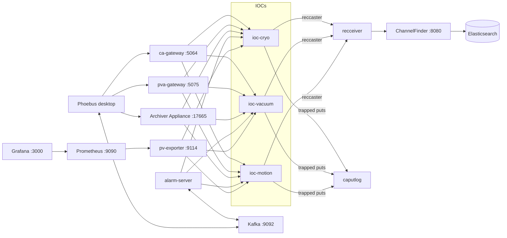

# EPICS Lab

A complete, containerized [EPICS](https://epics-controls.org) control-system
ecosystem: simulated IOCs, gateways, archiving, alarms, operator UI, and
observability — reproducible from a single `docker compose` file and covered
by an integration test suite.

## Stack

| Layer | Service(s) | Technology |
|---|---|---|
| Device control | `ioc-cryo`, `ioc-vacuum`, `ioc-motion` | EPICS 7 generic soft IOC (qsrv + iocStats + autosave) under procServ |
| Access layer | `ca-gateway`, `pva-gateway` | CA gateway (pcas), p4p PVA gateway — the only exposed control-plane ports |
| Archiving | `archiver`, `archiver-db` | EPICS Archiver Appliance + MariaDB |
| Alarms | `alarm-server`, `kafka` | Phoebus alarm server + Kafka (KRaft) |
| PV directory | `channelfinder`, `channelfinder-es`, `recceiver` | ChannelFinder + Elasticsearch, auto-populated via RecSync |
| Put audit | `caputlog` | caPutLog (TRAPWRITE) → central iocLogServer; `make caputlog` to follow |
| Operator UI | Phoebus (desktop) | `.bob` displays + client settings in `phoebus/` |
| Observability | `pv-exporter`, `prometheus`, `grafana` | PV → Prometheus bridge + dashboards |
| Testing | `tests` | Containerized pytest (p4p, caproto, kafka, HTTP) |



## Quick start

Bring the whole system up from a fresh Debian/Ubuntu or Fedora/RHEL host:

```bash
sudo ./scripts/install_requirements.sh   # Docker Engine + Compose v2, git, make
cp .env.example .env       # adjust passwords if desired
make build                 # build all images (first build compiles EPICS base,
                           #   Phoebus & ChannelFinder from source: 15-30 min)
make up                    # start the core stack
make bootstrap             # archive PVs + import alarm configuration
make test                  # run the integration test suite
make monitoring            # optional: Prometheus + Grafana
```

## Service URLs

| Service | URL / endpoint | Notes |
|---|---|---|
| Archiver Appliance UI | <http://localhost:17665/mgmt/ui/index.html> | manage/pause/resume archived PVs |
| Archiver data retrieval | `http://localhost:17665/retrieval/data/getData.json?pv=<PV>&from=<ISO>&to=<ISO>` | also `.csv`, `.mat`, `pbraw` |
| ChannelFinder | <http://localhost:8080/ChannelFinder> | e.g. [`/resources/channels?~name=LAB:CRYO:*`](http://localhost:8080/ChannelFinder/resources/channels?~name=LAB:CRYO:*) — auto-populated by RecSync |
| Grafana | <http://localhost:3000> | monitoring profile; dashboard *EPICS Lab Overview*; login `admin`/`GRAFANA_ADMIN_PASSWORD` |
| Prometheus | <http://localhost:9090> | monitoring profile |
| PV exporter metrics | <http://localhost:9114/metrics> | `epics_pv_value/severity/connected` |
| Channel Access | `localhost:5064` (CA gateway) | `EPICS_CA_ADDR_LIST=localhost caget LAB:CRYO:TC1:TEMP` |
| PV Access | `localhost` (PVA gateway, 5075/5076) | `EPICS_PVA_ADDR_LIST=localhost pvget LAB:CRYO:TC1:TEMP` |
| Kafka (alarms) | `localhost:9092` | Phoebus alarm apps, config `Lab` |
| Phoebus desktop | `phoebus.sh -settings phoebus/settings.ini` | open `phoebus/displays/main.bob` + Alarm Tree |

## Starting, stopping, operating

```bash
make up            # start (or apply compose changes to) the core stack
make down          # stop everything; data volumes are kept
make restart       # restart the core stack
make status        # service list with health
make logs S=<svc>  # follow logs, e.g. make logs S=ioc-cryo
docker compose restart ioc-cryo      # restart one service (e.g. after db edits)
make monitoring    # start Prometheus + Grafana profile
make console I=ioc-vacuum   # attach to an IOC shell (detach: Ctrl-], then quit)
make caputlog      # follow the CA write audit trail (who changed which PV)
make clean         # stop and DELETE all data volumes (archive, autosave, ...)
```

Services restart automatically (`restart: unless-stopped`) — after a host
reboot the stack comes back on its own once Docker starts. Kafka keeps the
alarm configuration in-container: after `make down`/`make clean` (not plain
restarts), run `make bootstrap` again. See
[docs/operations.md](docs/operations.md) for the full runbook.

## Simulated plant

All PVs follow `LAB:<AREA>:<DEVICE>:<SIGNAL>` (see
[docs/naming-conventions.md](docs/naming-conventions.md)):

- **Cryo** (`LAB:CRYO:*`) — cold head cools to `TC1:SP` while the compressor
  runs; stop `CMP1:RUN` and watch temperatures alarm as they drift to 293 K.
- **Vacuum** (`LAB:VAC:*`) — turbo pump spin-up, exponential pump-down, and a
  software interlock that force-closes the gate valve above 1e-4 mbar.
- **Motion** (`LAB:MOT:*`) — axis slews to `M1:SP` at `M1:VELO`, with done
  flag and limit switches.

## Repository layout

```
compose.yaml          orchestration of the full stack
images/               container image definitions (epics, archiver, alarm-server, channelfinder, recceiver, pva-gateway)
iocs/<name>/          per-IOC instance config: st.cmd, db/, req/ (mounted read-only)
gateway/              CA gateway pvlist/access, PVA gateway config
archiver/             PV list submitted to the archiver
alarms/               alarm server settings + alarm tree XML
channelfinder/        ChannelFinder settings + RecSync (recceiver) config
phoebus/              operator displays and client settings
services/pv-exporter/ PV -> Prometheus exporter
monitoring/           Prometheus/Grafana config and dashboards
tests/                integration test suite (runs in a container)
scripts/              operational tooling
docs/                 architecture, development, operations, ADRs
```

## Documentation

- [docs/architecture.md](docs/architecture.md) — components and data flow
- [docs/pv-catalog.md](docs/pv-catalog.md) — every PV: units, alarms, archived/exported flags
- [docs/development.md](docs/development.md) — adding IOCs, PVs, displays
- [docs/operations.md](docs/operations.md) — runbook, backup, production hardening
- [docs/naming-conventions.md](docs/naming-conventions.md) — PV naming rules
- [docs/adr/](docs/adr/) — architecture decision records
