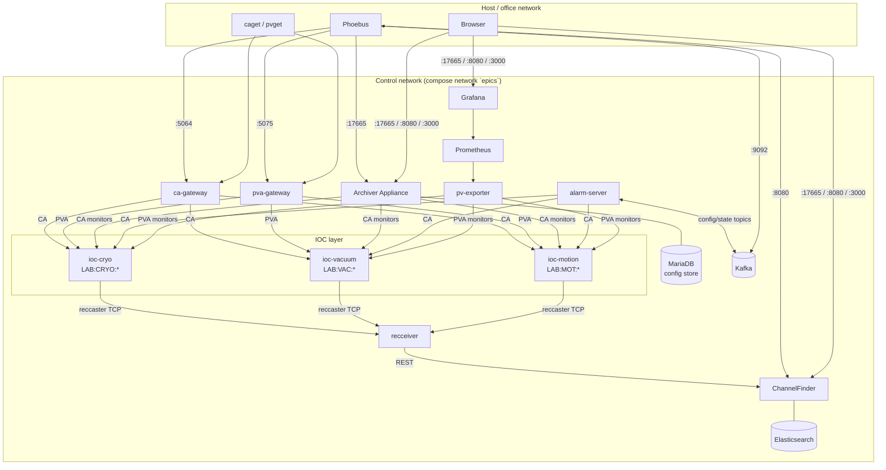

# Architecture

## Overview

The stack reproduces the standard architecture of a production EPICS
facility, scaled to run on one machine with Docker Compose. Every component
is the same software a real facility would run — only the "devices" are
simulated (plain EPICS databases with `calc` records).

## Key design points

### Generic IOC + mounted instance config

One image (`images/epics`, target `softioc`) contains a single `labioc`
binary linking EPICS base, QSRV (PV Access server), iocStats, and autosave.
Each IOC service mounts its instance directory (`iocs/<name>` → `/config`,
read-only) and a named volume for autosave files (`/autosave`). Adding an
IOC is a new directory plus ~10 compose lines — no image rebuild.

IOCs run under **procServ**, so operators can attach to the IOC shell
(`make console I=ioc-cryo`) exactly as they would on a production IOC host.

### Gateways as the only entry points

IOCs are reachable only inside the compose network. Host clients go through
the CA gateway (name filtering via `gateway/ca-gateway.pvlist`, access rules
via `ca-gateway.access`) or the p4p PVA gateway. This mirrors the
office/control-network split of a real facility, and the integration tests
deliberately route all PV traffic through the gateways.

### Archiver Appliance

Single-appliance deployment with all four webapps (`mgmt`, `engine`, `etl`,
`retrieval`) in one Tomcat (`ARCHAPPL_ALL_APPS_ON_ONE_JVM=true`), MariaDB as
the config store, and short/medium/long-term stores on named volumes. The PV
list in `archiver/pvlist.txt` is submitted idempotently by
`scripts/bootstrap_archiver.py` (`make bootstrap`).

### Alarms

Kafka (KRaft, no ZooKeeper) carries the Phoebus alarm topics — `Lab`
(compacted; config + state), `LabCommand`, `LabTalk` — created explicitly by
the `kafka-init` one-shot service. The Phoebus alarm server watches the PVs
declared in `alarms/lab_alarms.xml` over CA and publishes state changes;
Phoebus clients on the host connect via the external Kafka listener
(`localhost:9092`).

### PV directory (ChannelFinder + RecSync)

ChannelFinder (Spring Boot, Elasticsearch backend) is the queryable
directory of every PV in the facility. It is populated automatically by
RecSync: the generic IOC links the **reccaster** module, which announces
each IOC's full record list (plus `IOCNAME`, hostname, and environment) to
the **recceiver** service, which syncs it into ChannelFinder with
`hostName`/`iocName`/`pvStatus` properties. New IOCs therefore appear in
the directory with zero configuration. recceiver discovers clients via UDP
broadcast, which is why the compose network pins the `172.28.0.0/16`
subnet. Phoebus's ChannelFinder browser is pointed at the service by
`phoebus/settings.ini`, and the **PV Info** web UI (`pvinfo`, pinned tag,
served by nginx on :8082) gives operators a searchable browser over the
same data with per-PV archiver links; its nginx same-origin-proxies
ChannelFinder and the archiver retrieval webapp because ChannelFinder
4.7.x has no CORS configuration.

### Put audit trail (caPutLog)

Every IOC loads a shared access-security file (`iocs/common/lab.acf`) whose
WRITE rule carries `TRAPWRITE`; the caPutLog module forwards each trapped
put (client user/host, PV, old → new value, timestamp) to the `caputlog`
service — an `iocLogServer` from EPICS base writing a rotating file on the
`caputlog-data` volume. Follow it live with `make caputlog`. Writes coming
through the CA gateway are attributed to the gateway's identity; per-user
attribution across the gateway is a production hardening item (gateway
access rules / `caPutLog` on the gateway host).

### Observability

`pv-exporter` bridges a configurable PV list to Prometheus metrics
(`epics_pv_value/severity/connected`). Prometheus and Grafana are an
optional profile (`make monitoring`) with a provisioned overview dashboard.
This watches *the plant*; container health is covered by compose
healthchecks (`make status`).

## Ports (host)

| Port | Service | Purpose |
|---|---|---|
| 5064/5065 tcp+udp | ca-gateway | Channel Access |
| 5075 tcp, 5076 udp | pva-gateway | PV Access |
| 17665 | archiver | Archiver Appliance UI + retrieval |
| 8080 | channelfinder | ChannelFinder REST API |
| 8082 | pvinfo | PV Info web UI |
| 9092 | kafka | Alarm topics (external listener) |
| 9114 | pv-exporter | Prometheus metrics |
| 9090 / 3000 | prometheus / grafana | monitoring profile |

## Version pinning

Every component is pinned: EPICS base `R7.0.8.1`, iocStats `3.2.0`, autosave
`R5-11`, pcas `v4.13.3`, ca-gateway `v2.1.3`, procServ `2.8.0`, p4p `4.2.0`,
Archiver Appliance `1.1.0`, Phoebus `v4.7.3`, ChannelFinder `4.7.3`,
RecSync `1.9.6`, caPutLog `R4.2`, PV Info `2.8.2`, and upstream images via `.env`. Upgrades are one-line
ARG/env changes validated by `make test`.
